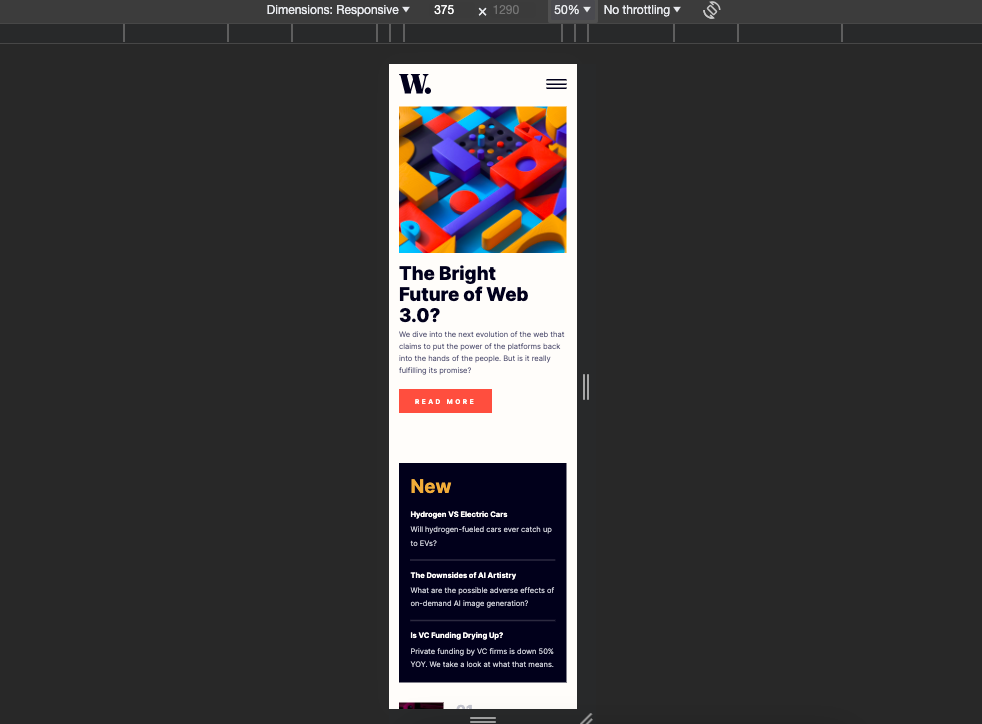

# Frontend Mentor - News homepage solution

This is a solution to the [News homepage challenge on Frontend Mentor](https://www.frontendmentor.io/challenges/news-homepage-H6SWTa1MFl). Frontend Mentor challenges help you improve your coding skills by building realistic projects.

## Table of contents

- [Overview](#overview)
  - [The challenge](#the-challenge)
  - [Screenshot](#screenshot)
  - [Links](#links)
- [My process](#my-process)
  - [Built with](#built-with)
  - [What I learned](#what-i-learned)
  - [Continued development](#continued-development)
  - [Useful resources](#useful-resources)
- [Author](#author)

## Overview

### The challenge

Users should be able to:

- View the optimal layout for the interface depending on their device's screen size
- See hover and focus states for all interactive elements on the page

### Screenshot




### Links

- Solution URL: https://github.com/shoproizoshlo/news-homepage-main
- Live Site URL: https://sue-news-homepage-main.netlify.app/

## My process

### Built with

- Semantic HTML5 markup
- CSS custom properties
- Flexbox

### What I learned

Creating hamburger menu

```html
<nav class="header_menu">
  <ul class="header_list">
    <li><a href="/" class="header_link">Home</a></li>
    <li><a href="/" class="header_link">New</a></li>
    <li><a href="/" class="header_link">Popular</a></li>
    <li><a href="/" class="header_link">Trending</a></li>
    <li><a href="/" class="header_link">Categories</a></li>
  </ul>
</nav>
```

```css
.header_burger {
  display: block;
  position: relative;
  width: 40px;
  height: 20px;
  z-index: 6;
}
.header_burger span {
  background-color: var(--neutral-very-dark-blue);
  position: absolute;
  width: 100%;
  height: 3px;
  top: 9px;
  transition: all 0.3s ease;
}
.header_burger::before,
.header_burger::after {
  content: "";
  background-color: var(--neutral-very-dark-blue);
  position: absolute;
  width: 100%;
  height: 3px;
  left: 0;
  transition: all 0.3s ease;
}
.header_burger::before {
  top: 0;
}
.header_burger::after {
  bottom: 0;
}

.header_burger.active span {
  transform: scale(0);
}
.header_burger.active::before {
  transform: rotate(-45deg);
  top: 9px;
}
.header_burger.active::after {
  transform: rotate(45deg);
  bottom: 9px;
}

.header_menu {
  position: fixed;
  top: 0;
  left: 100%;
  width: 70%;
  height: 100%;
  background-color: var(--neutral-off-white);
  padding: 200px 0 0 0;
  overflow: auto;
  transition: all 0.3s ease;
}
.header_menu.active {
  left: 30%;
  z-index: 5;
}
```

### Continued development

I've stack on the dark background when menu is open, if you have suggestions, please contact me

### Useful resources

- [Video how to make a hamburger menu](https://www.youtube.com/watch?v=chJQofBSx94&list=PLM6XATa8CAG6IJvQBkrTTNZmpIcyS2Avk&index=4) - Language - Russian, but feel free to open subtitles.
- [Examples of menus](https://alvarotrigo.com/blog/hamburger-menu-css/) -

## Author

- Website - [Sue Brechko](https://github.com/shoproizoshlo)
- Frontend Mentor - [@shoproizoshlo](https://www.frontendmentor.io/profile/shoproizoshlo)
- Twitter - [@suereact](https://www.twitter.com/suereact)
